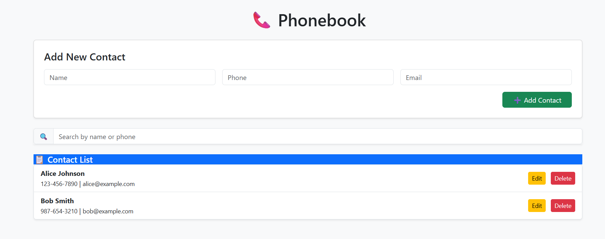

# PhoneBook App

A simple web-based PhoneBook application built with HTML, Bootstrap, and JavaScript.  
It allows you to add, edit, delete, and search contacts. Data is fetched from a local JSON server.

## Features

- **Add Contact:** Enter name, phone, and optional email to add a new contact.
- **Edit Contact:** Update contact details using the Edit button.
- **Delete Contact:** Remove contacts from the list.
- **Search:** Filter contacts by name, phone, or email.
- **Responsive Design:** Uses Bootstrap for a clean, mobile-friendly interface.

## Getting Started

1. **Clone or Download the Repository**
2. **Start a Local JSON Server**
   - Install [json-server](https://github.com/typicode/json-server) if not already installed:
     ```
     npm install -g json-server
     ```
   - Run the server in the `data` folder:
     ```
     json-server --watch data/contacts.json --port 3000
     ```
3. **Open `index.html` in your browser**

## File Structure

- `index.html` – Main HTML file
- `script.js` – JavaScript logic for CRUD operations
- `data/contacts.json` – Sample contact data for json-server
- `README.md` – Project documentation

## API Endpoints

- `GET /contacts` – Fetch all contacts
- `POST /contacts` – Add a new contact
- `PUT /contacts/:id` – Update a contact
- `DELETE /contacts/:id` – Delete a contact

## Screenshot



## License

MIT

---